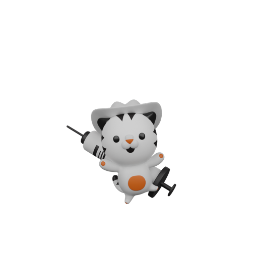
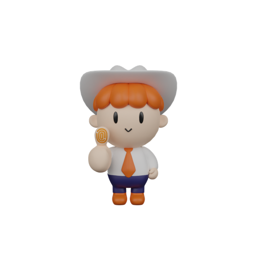
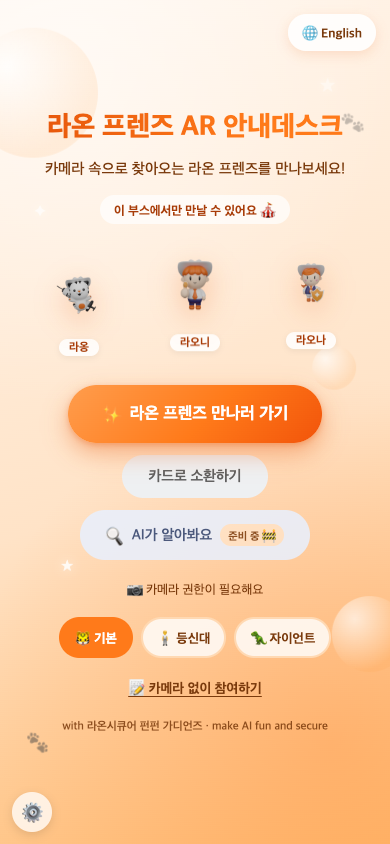
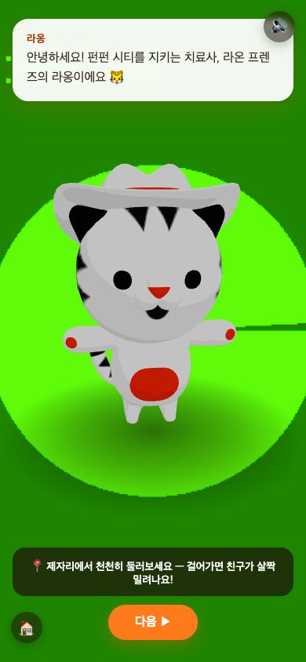
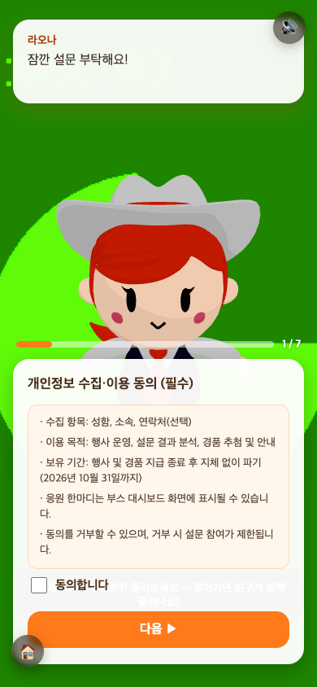
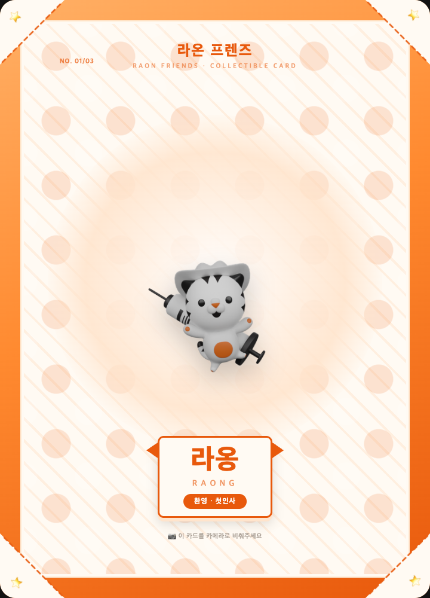
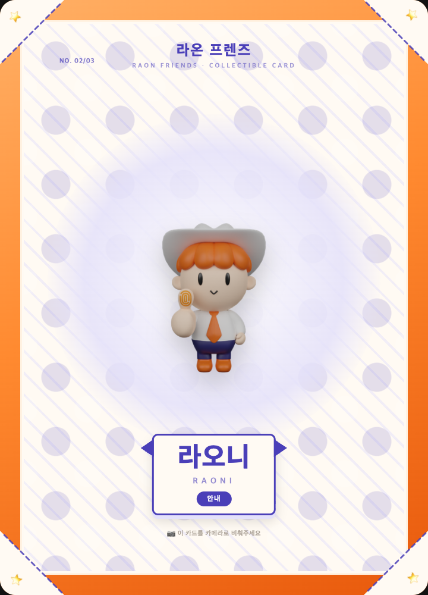
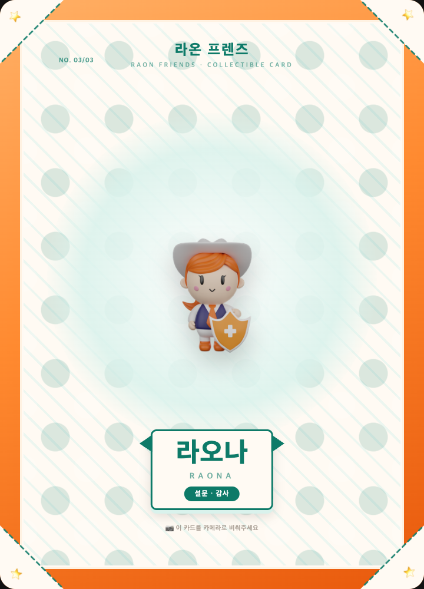

# 🐯 라온 프렌즈 AR 안내데스크

[](https://github.com/wantaekchoi/raon-friends-ar/actions/workflows/deploy.yml)


**QR 스캔 한 번으로, 앱 설치 없이 브라우저에서 라온 프렌즈가 AR로 등장합니다.**

2023년에 만들어진 뒤 잠들어 있던 라온시큐어 마스코트 3D 산출물을, [Claude Code](https://claude.com/product/claude-code)와 함께 설계부터 배포까지 진행해 웹 AR 안내 서비스로 되살린 프로젝트입니다. *"즐겁고 안전한 AI세상"* 이라는 [라온시큐어의 미션](https://www.raon.com/ko/about/company)처럼 — 보안 회사의 마스코트가 즐겁게 행사를 안내합니다. 사내 AI 활용 경진대회 출품작이에요.

### 👉 지금 체험하기

## 🔗 [https://wantaekchoi.github.io/raon-friends-ar/](https://wantaekchoi.github.io/raon-friends-ar/)

<p align="center">
  
  <br>
  <sub>스마트폰 카메라로 스캔하면 바로 접속됩니다</sub>
</p>

---

## 👋 캐릭터 소개 — 펀펀 가디언즈

> *"모두 즐겁고 안전한 AI세상을 만드는, 우리는 펀펀 가디언즈!"* — [라온시큐어 공식 캐릭터 세계관](https://www.raon.com/ko/intro/company/character)

'즐겁다'는 뜻의 순우리말 **라온**에서 태어난 세 수호자는, 디지털 도시 **펀펀 시티**를 바이러스·해킹·피싱으로부터 지킵니다. 이 프로젝트는 그 세계관 속 세 가디언즈를 증강현실로 소환해, *"make AI fun and secure"* 라는 다짐을 눈앞에서 움직이는 몸짓으로 보여줍니다.

| 캐릭터 | 이미지 | 무기 | 세계관 속 역할 | 이 앱에서의 역할 |
|---|---|---|---|---|
| **라옹** 🐯 |  | 백신 주사 | 도시를 순찰하며 감염된 시스템을 치료하는 **치료사** | **환영·인사** — 첫 등장 |
| **라오니** 🫆 |  | 생체인증 세이버 | 지문으로 전설의 무기를 깨운, 가장 먼저 위험을 감지하는 **리더** | **안내** — 프로젝트 소개 |
| **라오나** 🛡️ |  | 보안 방패 | 침입 경로를 분석해 방어 체계를 세우는 **해결사** | **설문·감사** — 마무리 |

> 오버레이·WebXR 모드에서는 라옹 → 라오니 → 라오나 순으로 배턴터치하며 등장합니다. 카드 마커 모드는 비춘 카드의 캐릭터가 그대로 진행을 맡아요. 세계관 출처: [raon.com 캐릭터 페이지](https://www.raon.com/ko/intro/company/character) · [회사 소개](https://www.raon.com/ko/about/company)

---

## 🎭 체험 모드 3종

같은 안내·설문 흐름을 세 가지 방식으로 체험할 수 있어요. 기기 지원 여부에 따라 자동으로 최선의 모드를 고를 수 있게, 시작 화면에서 직접 고릅니다.

| 모드 | 지원 범위 | 사용법 |
|---|---|---|
| **✨ 오버레이 모드** | 전 기기(iOS Safari / Android Chrome) | [바로 만나기]를 누르고 카메라를 허용하면, 자이로 센서로 시점을 맞춰 캐릭터가 내 앞 바닥에 서 있는 것처럼 보여줘요. 마커나 특별한 준비물이 필요 없는 기본 모드예요. 자이로는 회전만 추적해서, 걸어서 다가가기보다 제자리에서 둘러보는 게 자연스러워요. |
| **🃏 카드 마커 모드** | MindAR 지원 브라우저 | [카드로 소환하기]를 누른 뒤 카드(또는 화면에 띄운 카드 이미지)를 비추면, 그 카드 자리에 정확히 캐릭터가 올라타요(6DoF 부착). 소환 후에도 카드가 보이는 동안은 카드에 딱 붙어 있고, 카드를 놓치면 화면에 남았다가 다시 비추면 그 자리로 착 돌아와요. |
| **🧭 WebXR 바닥인식 모드 (Android 베타)** | WebXR hit-test 지원 기기 | 오버레이 모드 진입 후 노출되는 [진짜 바닥에 소환] 버튼을 누르면, 실제 바닥을 스캔해 캐릭터를 SLAM으로 고정해요. 자이로 추정이 아니라 실측 배치라 훨씬 안정적이에요. 미지원 기기에서는 버튼 자체가 보이지 않고 기존 오버레이로 그대로 진행돼요. |
| **🍏 iPhone 바닥 고정 (AR Quick Look)** | iOS Safari | 오버레이 모드 진입 후 노출되는 [진짜 바닥에 세우기] 버튼을 누르면, iOS 내장 ARKit 뷰어가 열려 캐릭터가 실제 바닥에 완벽하게 고정돼요(걸어 다녀도 그대로). 감상·기념사진용이고, 닫고 돌아오면 안내·설문이 이어져요. |

카메라를 켤 수 없는 환경이라면 시작 화면의 **[📝 카메라 없이 참여하기]** 링크로 AR 없이 바로 설문에 참여할 수 있어요.

---

## 📱 스크린샷

| 시작 화면 | AR 안내 — 라옹 | 설문 |
|:---:|:---:|:---:|
|  |  |  |

---

## 🃏 마커 카드

카드 마커 모드는 캐릭터별 전용 카드 3장으로 동작해요. 인쇄해서 부스에 비치하거나, **모니터·태블릿 화면에 카드 이미지를 띄워 카메라로 비춰도 그대로 인식**됩니다 — 실물 카드가 없어도 체험할 수 있어요.

| 라옹 카드 | 라오니 카드 | 라오나 카드 |
|:---:|:---:|:---:|
|  |  |  |

- 🖨️ **인쇄용 PDF**: [`docs/cards-print.pdf`](docs/cards-print.pdf) — 카드 3장을 A4 한 장에 원본 해상도로 배치. 코팅/무광 용지 인쇄를 추천해요(조명 반사가 인식을 방해할 수 있어요).
- 📸 **멀티 카드 동시 소환**: 카드 여러 장을 동시에 비추면 각 카드 자리에 각각의 캐릭터가 동시에 등장해요. 안내 진행(말풍선)은 먼저 인식된 카드 하나를 기준으로 이어집니다.
- 카드 준비·재제작 과정이 궁금하다면 [`docs/marker-setup.md`](docs/marker-setup.md)를 참고하세요.

---

## ✨ 기능 하이라이트

- **📱 무설치 웹AR** — 네이티브 앱 없이 iOS Safari / Android Chrome 브라우저에서 바로 동작. QR 코드 하나로 배포 완료.
- **🎭 3가지 AR 체험 모드** — 오버레이(자이로 지면 앵커) · 카드 마커(MindAR) · WebXR 바닥인식(Android 베타). 위 [체험 모드 3종](#체험-모드-3종) 참고.
- **🔊 효과음 + 음소거 토글** — 등장·탭·완료 등 순간마다 WebAudio 효과음이 울리고, 화면 우상단 버튼으로 언제든 끌 수 있어요(무음 상태는 기기에 저장).
- **🐾 캐릭터 쓰다듬기** — AR 화면에서 캐릭터를 탭하면 갸우뚱 리액션 + 하트 파티클이 터져요.
- **⭐ 별점 리액션** — 설문 만족도 문항에서 4~5점을 주면 캐릭터가 신나서 점프하고, 1~2점이면 잠깐 시무룩했다가 다시 손을 흔들어요.
- **📸 기념사진 공유** — 설문 완료 화면에서 카메라 프레임 + 3D 캐릭터 + 캡션을 합성한 사진을 바로 공유하거나 저장할 수 있어요.
- **📴 오프라인 응답 큐** — 네트워크가 불안정해 설문 전송이 실패해도 로컬에 응답을 쌓아두고, 다음 접속 시(또는 재시도 버튼으로) 자동 재전송해요.
- **🔒 개인정보 수집·이용 동의** — 설문 첫 문항에서 수집 항목·목적·보유 기간을 명시하고 동의를 받은 뒤에만 다음 문항으로 진행돼요.
- **🌐 다국어(한국어/영어)** — 시작 화면 🌐 버튼으로 전체 안내·설문·UI 문구가 즉시 전환돼요.
- **♿ 접근성** — 주요 상태 변화에 `aria-live` 알림, `prefers-reduced-motion` 대응(움직임 최소화 환경에서 애니메이션 자동 축소).
- **📝 비AR 참여 경로** — 카메라를 쓸 수 없는 환경도 [카메라 없이 참여하기]로 AR 없이 설문만 바로 참여 가능.
- **📊 실시간 부스 대시보드** — 참여 수·평균 만족도·최근 응원 한마디를 큰 화면에 띄워둘 수 있어요. 아래 [대시보드](#대시보드) 참고.
- **🔧 config 교체형 재사용 킷** — 안내 멘트·설문 문항·폼 ID·다국어 문구를 `src/config.js`·`src/i18n.js` 한 곳에서 관리. 코드 지식 없이 문구만 바꿔 재배포하면 어떤 사내 행사·부스에도 재사용할 수 있어요.

---

## ⚙️ URL 파라미터

대부분은 **앱 안에서 바로 선택**할 수 있어요 — 시작 화면의 캐릭터 크기 칩(🐯/🧍/🦖)과 좌하단 ⚙️ 운영자 설정(키오스크·매직미러 토글, 북마크용 URL 생성). 아래 파라미터는 북마크·QR 제작 등 URL로 직접 지정하고 싶을 때 사용합니다.

| 파라미터 | 값 | 설명 |
|---|---|---|
| `?lang=` | `ko` \| `en` | 안내·설문·UI 언어를 강제 지정. 시작 화면 🌐 버튼과 동일한 효과예요. |
| `?size=` | `life` \| `giant` | 캐릭터 크기. 기본은 소형 피규어 크기(약 1.2m 기준)이고, `life`는 실제 사람 키(1.8m), `giant`는 자이언트 스케일(2.5m)로 세워요. |
| `?camera=` | `user` | 후면 카메라 대신 전면(셀피) 카메라를 사용 — 노트북 웹캠으로 매직 미러처럼 쓸 때 필요해요. |
| `?kiosk=` | `1` | 키오스크 모드. 완료·에러 화면에서 일정 시간(기본 30초) 동안 입력이 없으면 다음 체험자를 위해 자동으로 처음 화면으로 되돌아가요. |
| `?char=` | `raong` \| `raoni` \| `raona` | 배턴터치 없이 지정한 캐릭터 한 명이 안내 전체를 단독으로 진행해요. |

### 🪞 매직 미러 부스 세팅 레시피

노트북 + 웹캠 + 대형 TV/모니터만 있으면 별도 키오스크 장비 없이 "매직 미러" 부스를 만들 수 있어요.

1. 노트북을 TV/모니터에 미러링하거나 HDMI로 연결
2. 웹캠을 노트북에 연결(내장 캠도 가능)
3. 브라우저에서 아래 주소를 엽니다.

```
https://wantaekchoi.github.io/raon-friends-ar/?kiosk=1&size=giant&camera=user
```

이렇게 열면 전면 웹캠으로 사람을 비추고, 자이언트 크기의 캐릭터가 옆에 서며, 체험이 끝나면 무입력 상태에서 자동으로 리셋되어 다음 방문객을 맞을 준비를 해요.

---

## 📊 대시보드 (부스 운영자용)

부스 운영자가 참여 현황(참여 수·평균 만족도·최근 응원 한마디)을 모니터에 띄워두는 별도 페이지입니다. 배포 URL 뒤에 `dashboard.html`을 붙여 접속합니다.

- **연동 대기(기본)** — `src/config.js`의 `DASHBOARD.csvUrl`이 비어 있으면 데이터 없이 연동 안내만 표시돼요. 가짜 숫자가 실데이터처럼 보이지 않도록, 데모 데이터는 주소 뒤에 **`?demo=1`** 을 붙였을 때만 나옵니다.
- **실시간 연동** — csvUrl에 구글 시트 게시 CSV 링크를 채우면 10초마다 폴링하며 실제 응답으로 갱신돼요.
- ⚠️ **개인정보 주의** — csvUrl에는 반드시 **개인정보 열이 없는 집계 전용 탭**의 게시 링크만 넣으세요. 원본 응답 시트를 게시하면 성함·연락처가 공개 URL로 노출됩니다. 대시보드 화면 자체는 만족도·응원 한마디만 표시해요.
- 로컬에서만 띄우려면: `npm run dev` 후 `http://localhost:5173/raon-friends-ar/dashboard.html?demo=1`

---

## 🛠️ 기술 스택

| 구분 | 기술 |
|---|---|
| 빌드 | [Vite](https://vitejs.dev/) 6 (index.html + dashboard.html 멀티 페이지) |
| 3D 렌더링 | [three.js](https://threejs.org/) (FBXLoader로 캐릭터 모델 직접 로드) |
| AR 오버레이 | `getUserMedia` 카메라 배경 + 투명 three.js 캔버스 + 자이로 시점 |
| 카드 마커 AR | [MindAR](https://hiukim.github.io/mind-ar-js-doc/) (이미지 타깃 트래킹, 사용 시점 지연 로드) |
| 바닥인식 AR | WebXR Device API (`hit-test`, Android Chrome 베타) |
| 오디오 | WebAudio API |
| 테스트 | [Vitest](https://vitest.dev/) |
| 배포 | GitHub Actions → GitHub Pages (main push 시 자동) |

---

## 🚀 로컬 실행

```bash
npm install --ignore-scripts   # mind-ar의 canvas 네이티브 빌드를 건너뜀 (docs/marker-setup.md 참고)
npm run dev
```

`http://localhost:5173/raon-friends-ar/` 접속 (Vite `base` 경로 포함).

```bash
npm run build     # 프로덕션 빌드 (dist/)
npm run preview   # 빌드 결과 로컬 미리보기
npm test          # Vitest 실행
npm run e2e       # E2E 시나리오 8종 (빌드 → preview 기동 → headless Chrome, fake 카메라)
```

### 배포 방법

`main` 브랜치에 push하면 `.github/workflows/deploy.yml`이 자동으로 `npm ci → npm test → npm run build` 후 GitHub Pages에 배포합니다. 별도 서버나 수동 배포 작업이 필요 없어요.

---

## 🎨 커스터마이즈 가이드

이 프로젝트는 코드를 건드리지 않고도 다른 행사·부스용으로 재사용할 수 있도록 만들어졌습니다. 대부분은 `src/config.js`와 `src/i18n.js` 두 파일만 고치면 됩니다.

```js
// src/config.js
export const CONFIG = {
  title: S.meta.title,            // 시작 화면 타이틀 (i18n.js STRINGS에서 언어별로 관리)
  guideScript: S.guideScript,     // 말풍선에 순서대로 나오는 안내 멘트
  characters: { /* 캐릭터별 이름·이미지 경로 */ },
  kiosk: { idleResetSec: 30 },    // ?kiosk=1 자동 리셋 대기 시간(초)
};
```

- **문구·다국어**: 안내 멘트·설문 문항·버튼 라벨 등 사용자 눈에 보이는 모든 텍스트는 `src/i18n.js`의 `STRINGS.ko` / `STRINGS.en` 사전에 있어요. 언어를 추가하려면 이 사전에 새 언어 키를 하나 더 채우면 됩니다.
- **설문·구글 폼 연동**: 설문 문항은 `STRINGS.*.survey.questions`, 폼 연동 설정(`GOOGLE_FORM`)은 `config.js`에서 관리합니다. 구글 폼의 `entry.숫자` ID를 얻는 방법은 [`docs/design.md` 7장 — 구글 폼 자동 전송 원리](docs/design.md#7-설문-설계-및-구글-폼-연동)를 참고하세요. 요약하면:
  1. 구글 폼 편집 화면 → ⋮ 메뉴 → **"미리 채워진 링크 받기"**
  2. 각 문항에 임의 값을 입력하고 링크 생성
  3. 생성된 URL 안의 `entry.xxxxx=값` 부분이 그 문항의 고유 ID
  4. 이 ID들을 `config.js`의 `GOOGLE_FORM.entries`에 채워 넣기
- **대시보드 연동**: `config.js`의 `DASHBOARD.csvUrl`에 구글 시트 "파일 > 웹에 게시" CSV 링크를 채우면 `dashboard.html`이 데모 데이터 대신 실제 응답을 보여줍니다.

---

## 📁 저장소 구조

```
raon-friends-ar/
├── index.html                  # 메인 앱
├── dashboard.html              # 부스 대시보드 (별도 빌드 엔트리)
├── vite.config.js              # base 경로 + 멀티 엔트리 + three shim + dedupe
├── src/
│   ├── main.js                 # 부트스트랩(377줄) — store/router/guide 배선, 진입 핸들러
│   ├── config.js               # 폼·대시보드·키오스크 설정 (운영자 수정 지점)
│   ├── i18n.js                 # 다국어(ko/en) 문자열 사전 + 언어 판별
│   ├── flow.js                 # 화면 흐름 상태머신 (START→GUIDE→SURVEY→DONE)
│   ├── characters.js           # FBX 모델 로딩·텍스처 보정
│   ├── motion.js               # 본 기반 모션 (wave·cheer·sad·wiggle·jump)
│   ├── effects.js              # 하트·별 파티클
│   ├── sound.js                # WebAudio 효과음 + 음소거
│   ├── survey.js               # 설문 렌더링·검증·구글 폼 전송
│   ├── queue.js                # 오프라인 응답 큐
│   ├── capture.js              # 기념 스크린샷 합성·공유
│   ├── app/                    # 셸 모듈 (v1.4.0 — main.js에서 분리)
│   │   ├── store.js             # URL 파라미터 파싱 + 구독 가능한 앱 상태
│   │   ├── storage-keys.js      # localStorage 키 상수
│   │   ├── router.js            # data-screen/data-mode 전환 단일 소유
│   │   ├── scenes.js            # asScene/NullScene — 씬 메서드 계약
│   │   ├── guide.js             # 안내·설문 흐름 (모드 무관)
│   │   ├── entry.js             # createOnceGuard — 모드 진입 중복 방지
│   │   ├── labels.js            # 시작 화면 정적 라벨 대입
│   │   ├── start-screen.js      # 온보딩·크기 칩·운영자 시트·언어/음소거 토글
│   │   └── timing.js            # scaledMs — ?timerScale= E2E 대기시간 단축
│   ├── scenes/
│   │   ├── overlay.js          # 오버레이 모드 (카메라 + 자이로 + 지면 앵커)
│   │   ├── marker.js           # 카드 마커 모드 (MindAR, 지연 로드)
│   │   └── webxr.js            # WebXR 바닥인식 모드 (hit-test)
│   ├── lib/three-compat.js     # mind-ar용 three.js 호환 shim
│   ├── ui/bubble.js            # 말풍선 타이핑 효과
│   └── style.css
├── public/
│   ├── img/                    # 캐릭터 썸네일
│   ├── models/                 # 캐릭터 3종 FBX + 텍스처
│   ├── targets/                # 마커 카드 3장 + cards.mind
│   └── sw.js                   # 오프라인 자산 캐시 (stale-while-revalidate)
├── test/                       # Vitest 120개
├── scripts/
│   ├── e2e.mjs                  # E2E 러너 (npm run e2e)
│   ├── e2e/
│   │   ├── harness.mjs          # puppeteer-core 하네스 (fake 카메라 headless Chrome)
│   │   └── scenarios/           # S0~S7 8종 (시작화면·오버레이·정체성·Vision·카드폴백·설문·파라미터·자이로)
│   └── export-usdz.mjs          # AR Quick Look용 .usdz 헤드리스 변환
├── docs/                       # 설계서·상태 문서·ADR·카드 PDF·QR
└── .github/workflows/deploy.yml # main push → npm ci → test → e2e 게이트 → build → Pages 배포
```

---

## 👥 만든 사람들

라온 프렌즈를 사랑하는 라온시큐어 구성원 4인 팀

*Made with [Claude Code](https://claude.com/product/claude-code)*

---

## ⚖️ 자산 고지

라온 프렌즈(라옹·라오니·라오나) 캐릭터와 "펀펀 가디언즈" 세계관은 **라온시큐어의 자산**입니다. 이 저장소는 사내 행사·경진대회 목적으로 해당 자산을 활용하며, 캐릭터 자산의 별도 재사용은 라온시큐어 브랜드 가이드라인을 따라야 합니다.
